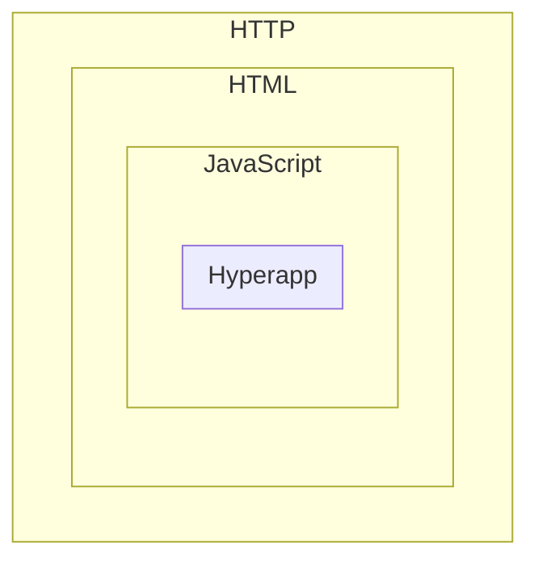

# Metapsi

Metapsi is a full stack .NET framework that features queued processing and C# defined client-side web pages.

Key features:
* JavaScript on request
* C# typed all the way
* Server-side rendering
* Client-side rendering
* Client-side LINQ expressions
* Implicit Model-View-Update architecture (elm style)
* Out-of-the-box support for Shoelace and Ionic
* Automatic JS imports of the required modules only
* Self-contained: no NPM needed, no static files to deploy


Documentation and sandbox at https://metapsi.dev 

Ready to run samples at https://github.com/qwebsolutions/metapsi.samples

Join us on Discord https://discord.gg/ZZ5TVHPta2

[Roadmap](roadmap.md)

## How to create a Metapsi project

Initialize a new console project

```
dotnet new console
```

### Csproj sample

```xml
<Project Sdk="Microsoft.NET.Sdk">
    <PropertyGroup>
        <OutputType>Exe</OutputType>
        <TargetFramework>net8.0</TargetFramework>
    </PropertyGroup>
    <ItemGroup>
        <PackageReference Include="Metapsi.Html" Version="*" />
        <PackageReference Include="Metapsi.Ionic" Version="*" />
        <PackageReference Include="Metapsi.Shoelace" Version="*" />
        <PackageReference Include="Metapsi.ServiceDoc" Version="*" />
    </ItemGroup>

    <ItemGroup>
        <EmbeddedResource Include="embedded\MyProject.css" LogicalName="MyProject.css" />
    </ItemGroup>

</Project>
```

### Program.cs sample

```C#
using Microsoft.AspNetCore.Builder;
using System.Threading.Tasks;
using Metapsi;
using Metapsi.Html;
using Metapsi.Hyperapp;
using Metapsi.Ionic;

public class MyProjectModel
{
    public string ServerSideRenderedText { get; set; } = "This div is rendered server-side";
    public string ClientSideRenderedText { get; set; } = "This div is rendered client-side";
    public string Text { get; set; }
    public bool TextPosted { get; set; }
}

public static class Program
{
    public static async Task Main()
    {
        var app = WebApplication.CreateBuilder().AddMetapsi().Build();
        app.UseMetapsi();
        app.Urls.Add("http://localhost:5000");
        app.MapServerActions();
        app.MapGet("/", () => Page.Result(new MyProjectModel()));

        app.UseRenderer<MyProjectModel>(
            model => HtmlBuilder.FromDefault(
            b =>
            {
                b.AddStylesheet(typeof(Program).Assembly, "MyProject.css");

                b.BodyAppend(
                    b.HtmlDiv(
                        b =>
                        {
                            b.SetClass("server-side");
                        },
                        b.Text(model.ServerSideRenderedText),
                        b.Hyperapp(
                            model,
                            (b, model) =>
                            {
                                return b.HtmlDiv(
                                    b =>
                                    {
                                        b.SetClass("client-side");
                                    },
                                    b.Text(b.Get(model, x => x.ClientSideRenderedText)),
                                    b.HtmlDiv(
                                        b =>
                                        {
                                            b.AddStyle("display", "flex");
                                            b.AddStyle("gap", "10px");
                                        },
                                        b.HtmlInput(
                                            b =>
                                            {
                                                b.SetPlaceholder("Enter some text here");
                                                b.SetDisabled(b.Get(model, x => x.TextPosted));
                                                b.BindTo(model, x => x.Text);
                                            }),
                                        b.HtmlButton(
                                            b =>
                                            {
                                                b.AddStyle("color", "rgb(146 64 14)");
                                                b.SetDisabled(b.Get(model, x => x.TextPosted));
                                                b.OnClickAction(
                                                    b.CallServer(
                                                        async (MyProjectModel model) =>
                                                        {
                                                            model.TextPosted = true;
                                                            return model;
                                                        }));
                                            },
                                            b.Text("Done"))));
                            })));
            }).ToHtml());

        await app.RunAsync();
    }
}
```

### Embedded css sample (MyProject.css)

```CSS
body {
    font-family: Arial;
    font-size: 16px;
}

.server-side {
    border: 1px solid rgb(6 95 70);
    border-radius: 6px;
    color: rgb(6 95 70);
    padding: 10px;
    max-width: 500px;
    display: flex;
    flex-direction: column;
    gap: 15px;
}

.client-side {
    border: 1px solid rgb(146 64 14);
    border-radius: 6px;
    color: rgb(146 64 14);
    padding: 10px;
    display: flex;
    flex-direction: column;
    gap: 15px;
}
```

The "it just works" experience heavily relies on embedded resources. To add embedded resources to your project, include them in your csproj and then reference them as in the Program.cs sample


## Packages

You can reference one or more of the Metapsi packages, based on the project requirements

* Metapsi.Runtime - Some basic core functionality of Metapsi. Usually you don't need to add it explicitly, as it's referenced by all the other packages
* Metapsi.Html - Allows you to build server-side & client-side rendered web pages
* Metapsi.Ionic - Out of the box support for Ionic framework (references Metapsi.Html)
* Metapsi.Shoelace - Out of the box support for Shoelace web components (references Metapsi.Html)
* Metapsi.ServiceDoc - SQLITE based index database used for configuration & quick prototyping

## Metapsi.Html overview



Yes, it's very back to basics: return a string body that contains HTML. Some of the HTML tags are script tags generated server side. Some of the generated JavaScript might use Hyperapp. Each nested level has a tailored special builder.

### HTTP

Handled by mostly using Minimal API.

Use .AddMetapsi() & .UseMetapsi() when you configure your web application. This allows you to render HTML and to use embedded files.

Data retrieval and rendering are two separate steps (a common theme all over Metapsi).

While you would normally return data from an API like this:

```C#
public class DataModel
{
    public string Title { get; set; } = "Title";
    public string Message { get; set; } = "Hi! It works!";
}

app.MapGet("/", () => return new DataModel());
```

... to convert it to a Metapsi web page you simply:

```C#
app.MapGet("/", () => return Page.Result(new DataModel()));
```

Metapsi matches data and renderer by data type.

### HTML

The most basic renderer can directly return a raw string.

```C#
app.UseRenderer<DataModel>(model => $"<html> <head><title>{model.Title}</title></head><body>{model.Message}</body></html>");
```

To simplify building HTML:
```C#
app.UseRenderer<DataModel>(
    model => HtmlBuilder.FromDefault(
        b =>
        {
            b.HeadAppend(b.HtmlTitle(model.Title));
            b.BodyAppend(b.Text(model.Message));
        }).ToHtml());
```

This creates an initially mostly empty default HTML document for you to fill in.

Then you can add JavaScript just like any other tag:

```C#
app.UseRenderer<DataModel>(
    model => HtmlBuilder.FromDefault(
    b =>
    {
        b.HeadAppend(b.HtmlTitle(model.Title));
        b.BodyAppend(b.HtmlScript($"alert('{model.Message}')"));
    }).ToHtml());
```

### JavaScript

We wouldn't want to add raw JS to our output though.

```C#
app.UseRenderer<DataModel>(
    model => HtmlBuilder.FromDefault(
    b =>
    {
        b.HeadAppend(b.HtmlTitle(model.Title));
        b.BodyAppend(b.HtmlScriptModule(b =>
        {
            b.Alert(model.Message);
        }));
    }).ToHtml());
```

You can, of course, try to implement some (simple) dynamic logic at this builder level.

```C#
app.UseRenderer<DataModel>(
    model => HtmlBuilder.FromDefault(
    b =>
    {
        b.HeadAppend(b.HtmlTitle(model.Title));
        b.BodyAppend(b.HtmlButton(
            b =>
            {
                b.SetId("click-me");
                b.SetStyle("color:blue");
            },
            b.Text("Click me!")));
        b.BodyAppend(b.HtmlScriptModule(b =>
        {
            b.SetProperty(
                b.GetElementById("click-me"),
                b.Const("onclick"),
                b.Def((SyntaxBuilder b) =>
                {
                    b.Alert(model.Message);
                }));
        }));
    }).ToHtml());
```

However ...

### Hyperapp

For client-side rendered pages the recommended builder level is the [Hyperapp](https://github.com/jorgebucaran/hyperapp) level. This is a minimal framework that handles the virtual dom, page events and model updates.

```C#
app.UseRenderer<DataModel>(
    model => HtmlBuilder.FromDefault(
    b =>
    {
        b.HeadAppend(b.HtmlTitle(model.Title));
        b.BodyAppend(
            b.Hyperapp(
                model,
                (b, model) =>
                {
                    return b.HtmlButton(
                        b =>
                        {
                            b.AddStyle("color", "green");
                            b.OnClickAction((SyntaxBuilder b, Var<DataModel> model) =>
                            {
                                b.Alert(b.Get(model, x => x.Message));
                                b.Set(model, x => x.Message, b.Const("Already clicked!"));
                                return b.Clone(model);
                            });
                        },
                        b.Text("Click me!"));
                }));
    }).ToHtml());
```


## Web components

Metapsi supports Shoelace and Ionic out of the box. As these are web component libraries they are used like any other HTML tag. To avoid the flash of unstyled content you can use .UseWebComponentsFadeIn, that tracks usage of supported web components.

### Shoelace

Install Metapsi.Shoelace nuget package.

#### Server-side rendering

```C#
app.UseRenderer<DataModel>(
    model => HtmlBuilder.FromDefault(
    b =>
    {
        b.UseWebComponentsFadeIn();
        b.HeadAppend(b.HtmlTitle(model.Title));
        b.BodyAppend(
            b.SlDialog(
                b =>
                {
                    b.SetStyle("font-family:var(--sl-font-sans)");
                    b.SetLabel("Shoelace dialog");
                    b.SetOpen();
                },
                b.Text(model.Message)));
    }).ToHtml());
```

#### Client-side rendering

```C#
app.UseRenderer<DataModel>(
    model => HtmlBuilder.FromDefault(
    b =>
    {
        b.UseWebComponentsFadeIn();
        b.HeadAppend(b.HtmlTitle(model.Title));
        b.BodyAppend(
            b.Hyperapp(
                model,
                (b, model) =>
                b.HtmlDiv(
                    b.SlDialog(
                        b =>
                        {
                            b.AddStyle("font-family", "var(--sl-font-sans)");
                            b.SetId("shoelace-dialog");
                            b.SetLabel("Shoelace dialog");
                        },
                        b.Text(b.Get(model, x => x.Message)),
                        b.SlButton(
                            b =>
                            {
                                b.SetSlot(SlDialog.Slot.Footer);
                                b.SetVariantSuccess();
                                b.OnClickAction((SyntaxBuilder b, Var<DataModel> model) =>
                                {
                                    b.HideDialog("shoelace-dialog");
                                    return b.Clone(model);
                                });
                            },
                            b.Text("Great!"))),
                    b.SlButton(
                        b =>
                        {
                            b.OnClickAction((SyntaxBuilder b, Var<DataModel> model) =>
                            {
                                b.ShowDialog("shoelace-dialog");
                                return b.Clone(model);
                            });
                        },
                        b.Text("Open dialog")))));
    }).ToHtml());
```

### Ionic

Install Metapsi.Ionic nuget package. 

#### Server-side rendering

```C#
app.UseRenderer<DataModel>(
    model => HtmlBuilder.FromDefault(
    b =>
    {
        b.UseWebComponentsFadeIn();
        b.HeadAppend(b.HtmlTitle(model.Title));
        b.BodyAppend(
            b.IonApp(
                b.IonContent(
                    b.IonAlert(
                        b =>
                        {
                            b.SetIsOpen();
                            b.SetHeader(model.Title);
                            b.SetMessage(model.Message);
                        }))));
    }).ToHtml());
```

#### Client-side rendering

```C#
app.UseRenderer<DataModel>(
    model => HtmlBuilder.FromDefault(
    b =>
    {
        b.UseWebComponentsFadeIn();
        b.HeadAppend(b.HtmlTitle(model.Title));
        b.BodyAppend(
            b.Hyperapp(
                model,
                (b, model) =>
                {
                    return b.IonApp(
                        b.IonContent(
                            b.IonAlert(
                                b =>
                                {
                                    b.SetIsOpen();
                                    b.SetHeader(b.Get(model, x => x.Title));
                                    b.SetMessage(b.Get(model, x => x.Message));
                                })));
                }));
    }).ToHtml());
```

## SignalR

With SignalR and Hyperapp you can easily control client-side updates.

```C#

using Microsoft.AspNetCore.Builder;
using System.Threading.Tasks;
using Metapsi;
using System;
using Metapsi.Html;
using Metapsi.Syntax;
using Metapsi.Hyperapp;
using System.Collections.Generic;
using System.Linq;
using Metapsi.SignalR;

public class Entry
{
    public string Ticker { get; set; }
    public string Name { get; set; }
    public decimal Value { get; set; } = 100;
    public bool GoingUp { get; set; } = true;
}

public class MarketData
{
    public List<Entry> Entries { get; set; } = new List<Entry>()
    {
        new Entry(){ Ticker = "NVDA", Name = "Nvidia" },
        new Entry(){ Ticker = "AAPL", Name = "Apple" },
        new Entry(){ Ticker = "TSLA", Name = "Tesla" },
        new Entry(){ Ticker = "AMZN", Name = "Amazon" },
        new Entry(){ Ticker = "MSFT", Name = "Microsoft" }
    };
}

public class Refresh
{
    public MarketData MarketData { get; set; }
}

public static class Program
{
    public static async Task Main()
    {
        // AddMetapsiSignalR preserves JSON capitalization
        var app = WebApplication.CreateBuilder().AddMetapsi().AddMetapsiSignalR().Build();
        app.UseMetapsi();
        app.MapDefaultSignalRHub();
        app.MapGet("/", () => Page.Result(new MarketData()));

        app.UseRenderer<MarketData>(
            model => HtmlBuilder.FromDefault(
            b =>
            {
                b.UseWebComponentsFadeIn();
                b.HeadAppend(b.HtmlTitle("Market data, absolutely real time for sure ..."));
                b.BodyAppend(
                    b.Hyperapp<MarketData>(
                        InitializeClientSideApp,
                        RenderClientSideApp,
                        ListenToUpdates));
            }).ToHtml());

        var _notAwaited = Task.Run(GenerateRandomData);

        await app.RunAsync();
    }

    public static Var<HyperType.Init> InitializeClientSideApp(SyntaxBuilder b)
    {
        return b.MakeInit(
            b.MakeStateWithEffects(
                b.Const(new MarketData()),
                // Connect to default SignalR hub
                b.SignalRConnect()));
    }

    public static Var<HyperType.Subscription> ListenToUpdates(SyntaxBuilder b, Var<MarketData> _modelNotUsed)
    {
        // Listen to SignalR event
        return b.Listen(b.MakeAction((SyntaxBuilder b, Var<MarketData> model, Var<Refresh> refreshEvent) =>
        {
            // Return the data. Hyperapp triggers automatic refresh
            return b.Get(refreshEvent, x => x.MarketData);
        }));
    }

    public static Var<IVNode> RenderClientSideApp(LayoutBuilder b, Var<MarketData> model)
    {
        return b.HtmlDiv(
            b.Map(
                b.Get(model, x => x.Entries.OrderByDescending(x => x.Value).ToList()),
                (b, company) =>
                {
                    return b.HtmlDiv(
                        b =>
                        {
                            b.AddStyle("display", "flex");
                            b.AddStyle(
                                "color",
                                b.If(
                                    b.Get(company, x => x.GoingUp),
                                    b => b.Const("green"),
                                    b => b.Const("red")));
                        },
                        b.HtmlDiv(
                            b =>
                            {
                                b.AddStyle("width", "100px");
                            },
                            b.Text(b.Get(company, x => x.Ticker))),
                        b.HtmlDiv(
                            b =>
                            {
                                b.AddStyle("width", "150px");
                            },
                            b.Text(b.Get(company, x => x.Name))),
                        b.HtmlDiv(
                            b =>
                            {
                                b.AddStyle("width", "50px");
                            },
                            b.Text(b.AsString(b.Get(company, x => x.Value)))));
                }));
    }

    public static async Task GenerateRandomData()
    {
        MarketData marketData = new();

        Random r = new Random();

        while (true)
        {
            await Task.Delay(3000);
            foreach (var entry in marketData.Entries)
            {
                var newValue = entry.Value + new decimal(r.NextDouble() - 0.5) * 2;
                entry.GoingUp = newValue > entry.Value;
                entry.Value = decimal.Round(newValue, 2);
            }

            // Raise SignalR event with new data
            await DefaultMetapsiSignalRHub.HubContext.Clients.All.RaiseEvent(new Refresh()
            {
                MarketData = marketData
            });
        }
    }
}

```
