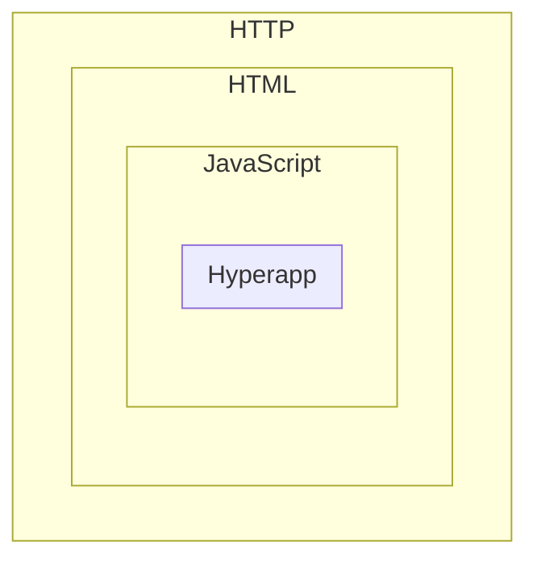

# Metapsi

Metapsi is a full stack .NET framework that features queued processing and  C# defined client-side web pages.

https://metapsi.dev

## Metapsi.Html overview




Yes, it's very back to basics: return a string body that contains HTML. Some of the HTML tags are script tags generated server side. Some of the generated JavaScript might use Hyperapp. Each nested level has a tailored special builder.

### HTTP

Handled by mostly using Minimal API.

Use .AddMetapsi() & .UseMetapsi() when you configure your web application. This allows you to render HTML and to use embedded files.

Data retrieval and rendering are two separate steps (a common theme all over Metapsi).

While you would normally return data from an API like this:

```C#
public class DataModel
{
    public string Title { get; set; } = "Title";
    public string Message { get; set; } = "Hi! It works!";
}

app.MapGet("/", () => return new DataModel());
```

... to convert it to a Metapsi web page you simply:

```C#
app.MapGet("/", () => return Page.Result(new DataModel()));
```

Metapsi matches data and renderer by data type.

### HTML

The most basic renderer can directly return a raw string.

```C#
app.UseRenderer<DataModel>(model => $"<html> <head><title>{model.Title}</title></head><body>{model.Message}</body></html>");
```

To simplify building HTML:
```C#
app.UseRenderer<DataModel>(
    model => HtmlBuilder.FromDefault(
        b =>
        {
            b.HeadAppend(b.HtmlTitle(model.Title));
            b.BodyAppend(b.Text(model.Message));
        }).ToHtml());
```

This creates an initially mostly empty default HTML document for you to fill in.

Then you can add JavaScript just like any other tag:

```C#
app.UseRenderer<DataModel>(
    model => HtmlBuilder.FromDefault(
    b =>
    {
        b.HeadAppend(b.HtmlTitle(model.Title));
        b.BodyAppend(b.HtmlScript($"alert('{model.Message}')"));
    }).ToHtml());
```

### JavaScript

We wouldn't want to add raw JS to our output though.

```C#
app.UseRenderer<DataModel>(
    model => HtmlBuilder.FromDefault(
    b =>
    {
        b.HeadAppend(b.HtmlTitle(model.Title));
        b.BodyAppend(b.HtmlScriptModule(b =>
        {
            b.Alert(model.Message);
        }));
    }).ToHtml());
```

You can, of course, try to implement some (simple) dynamic logic at this builder level.

```C#
app.UseRenderer<DataModel>(
    model => HtmlBuilder.FromDefault(
    b =>
    {
        b.HeadAppend(b.HtmlTitle(model.Title));
        b.BodyAppend(b.HtmlButton(
            b =>
            {
                b.SetId("click-me");
                b.SetStyle("color:blue");
            },
            b.Text("Click me!")));
        b.BodyAppend(b.HtmlScriptModule(b =>
        {
            b.SetProperty(
                b.GetElementById("click-me"),
                b.Const("onclick"),
                b.Def((SyntaxBuilder b) =>
                {
                    b.Alert(model.Message);
                }));
        }));
    }).ToHtml());
```

However ...

### Hyperapp

For client-side rendered pages the recommended builder level is the [Hyperapp](https://github.com/jorgebucaran/hyperapp) level. This is a minimal framework that handles the virtual dom, page events and model updates.

```C#
app.UseRenderer<DataModel>(
    model => HtmlBuilder.FromDefault(
    b =>
    {
        b.HeadAppend(b.HtmlTitle(model.Title));
        b.BodyAppend(
            b.Hyperapp(
                model,
                (b, model) =>
                {
                    return b.HtmlButton(
                        b =>
                        {
                            b.AddStyle("color", "green");
                            b.OnClickAction((SyntaxBuilder b, Var<DataModel> model) =>
                            {
                                b.Alert(b.Get(model, x => x.Message));
                                b.Set(model, x => x.Message, b.Const("Already clicked!"));
                                return b.Clone(model);
                            });
                        },
                        b.Text("Click me!"));
                }));
    }).ToHtml());
```
